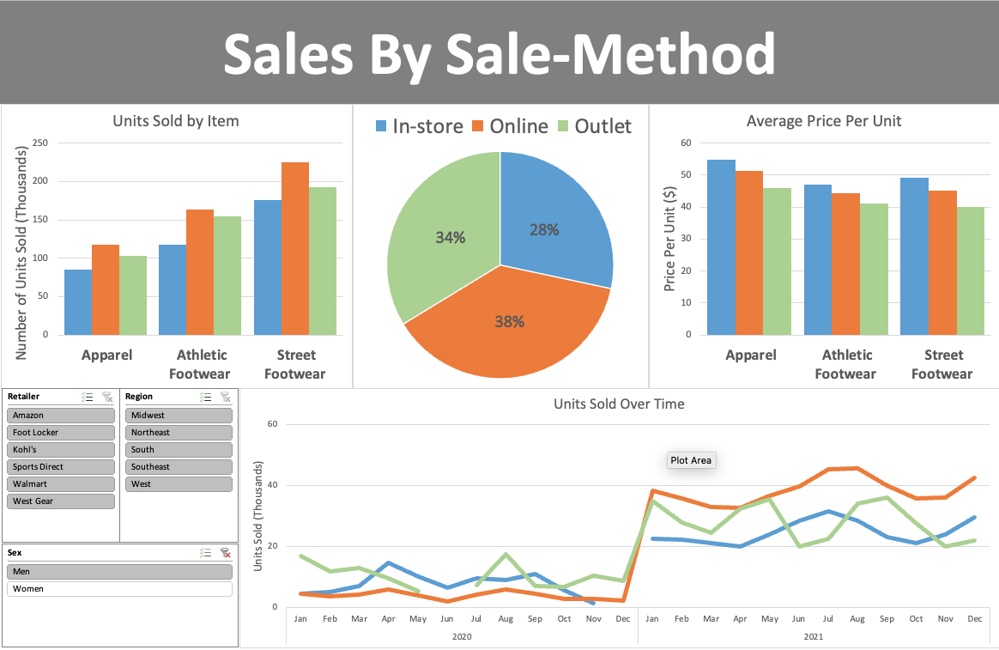

# adidas_BI
Analyzing Adidas sales data.

## Purpose:
As times change and the world moves to be more online, companies like Adidas need to pay close attention to customer behavior. Adidas needs to analyze their sales data to determine where, when, and how their customers are buying Adidas products in order to optimize marketing, inventory, and future plans. 

This project aims to identify key performance indicators and trends in Adidas's sales data in order to make recommendations on areas of need and potential. 

## Methodology: 

### Data Source: [Kaggle](https://www.kaggle.com/datasets/heemalichaudhari/adidas-sales-dataset)

### Excel:
This analyis project was completed in Microsoft Excel. 

The product column was separated into two separate columns: one for the "gender" of the item and the other for the item itself. 

Pivot tables and pivot charts were made from the data to identify KPIs. 

Related pivot charts were combined in order to form dashboards. Slicers were added to the dashboards in order to better analyze the data. Users can filter the data by the "gender", region, and/or the retailer. 

## Dashboard 1: Sales By Sale Method

### Key Findings: 
* Apparel items geared toward females are far more popular than those geared toward men regardless of sale-method; this correlates with a higher preice per unit for female apparel items as well. This demonstrates that raising the price of female oriented goods does not equate to lower sales.
* There is a 46.71% drop in outlet units sold in the Summer 2021 during the months of June and July. A significant drop in units sold was also present in the Summer of 2020. It mat be worth investing in marketing towards students out for the summer or ensuring inventory is not sitting to avoid inventory obsolescence.
* a

## Dashboard 2: KPIs by Region and by Retailer (IN PROGRESS)
